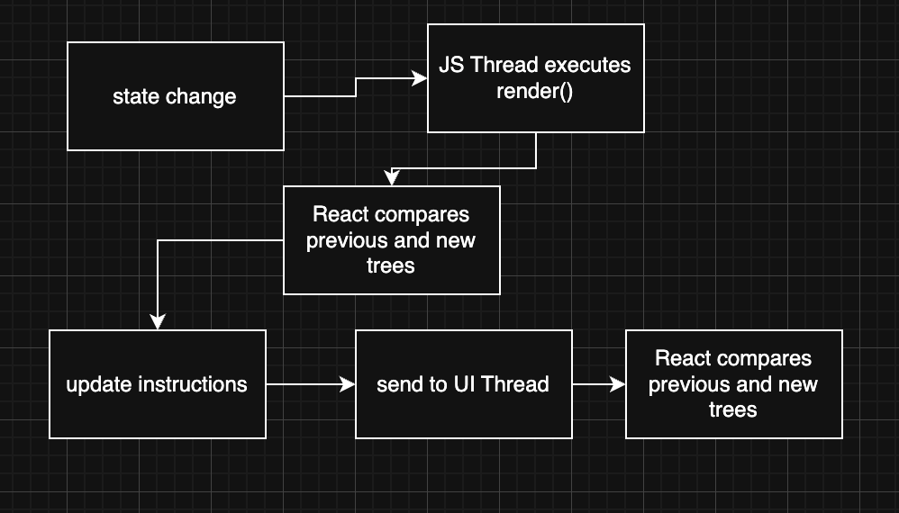

# threading model

React native was build to be thread-safe, Security is guaranteed because immutable data structures are used internally in the framework imposed by “const correctness.”

#### Goals of this architecture
- interruptible rendering
- Prioritize high-priority events
- Avoiding UI blocking
- Make rendering more predictable

### use two different renders
- UI thread (often called main): The only thread that can manipulate host views.
- JavaScript thread: This is where React’s render phase, as well as layout, are executed.

### Render JS Thread
- Responsible to run js code
- components, states, diffs, updates



```javascript
const [count, setCount] = useState(0);

return (
  <Text onPress={() => setCount(count + 1)}>
    {count}
  </Text>
);
```

### Render UI Thread
- Run Animations
- Draw pixel