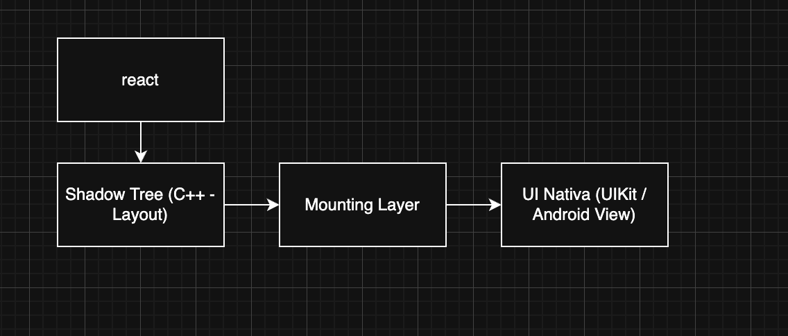

# Shadow Tree
- Estrutura que representa os componentes do layout
- Planta arquitetonica da UI
- Usa Yoga para calcular layout

### Code Example
```javascript
<View>
  <Text>Hello</Text>
</View>
```

### Flowchart
